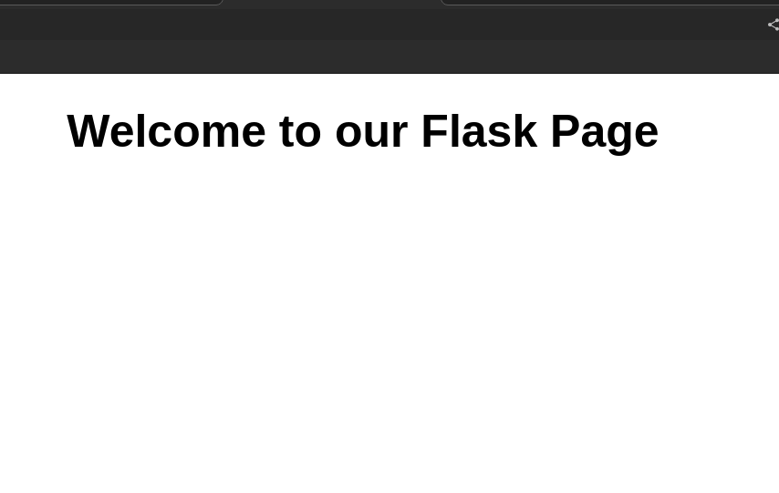

# CI/CD Pipeline Setup

## Step 1: Create a Github Repository

    https://github.com/Sadashiva84/ci_cd_pipeline/tree/prod

## Step 2: Create a Clone of it in Local

    Local Directory Location: /home/infeon/Projects/devops/vired/ci_cd_pipeline

## Step 3: Create a Bash Script to Pull Code from Remote Repository

> echo "Going to pull from your repository"

>cd ci_cd_pipeline

>git checkout prod

>git pull

### Explanation of the Bash Script

### This script does the following:

    Prints a message indicating it's about to pull from the repository.
    Changes the directory to the ci_cd_pipeline folder.
    Checks out the prod branch.
    Pulls the latest code changes from the remote repository.

## Step 4: Create a Bash Script to Deploy or Move the Code to the Nginx Folder

> cd /home/infeon/Projects/devops/vired/ci_cd_pipeline

> git checkout prod

> #!/bin/bash

>echo "This script is working"

### Get the latest commit ID from the git log
>commit=$(git log -n 1 --format="%H")

### Check if the commit ID is new
>if ! grep -q $commit /home/infeon/Projects/devops/vired/commit_check.txt; then
  echo "now in then block"
  #### If the commit ID is new, move files from the source directory to the destination directory
 > cp /home/infeon/Projects/devops/vired/ci_cd_pipeline/* /var/www/html/
  
  ### Add the new commit ID to the commit check file
  > echo "$commit" >> /home/infeon/Projects/devops/vired/commit_check.txt
fi
"

### Explanation of the Bash Script

This script does the following:

    Changes the directory to the ci_cd_pipeline folder.
    Checks out the prod branch.
    Prints a message indicating that the script is working.
    Gets the latest commit ID from the git log.
    Checks if the commit ID is new by comparing it with the entries in the commit_check.txt file.
    If the commit ID is new, it moves files from the source directory to the destination directory (/var/www/html/) and adds the new commit ID to the commit_check.txt file.

## Step 5: Create a Cron Job to Run the Bash Scripts Every Minute

> `* * * * * /home/infeon/Projects/devops/vired/pull_prod.sh'

> '* * * * * /home/infeon/Projects/devops/vired/prod-code.sh'

##### These cron job entries execute the pull_prod.sh and prod-code.sh scripts every minute to automate the CI/CD pipeline process.

> Final Deployed Website on Nginx
  

---
---